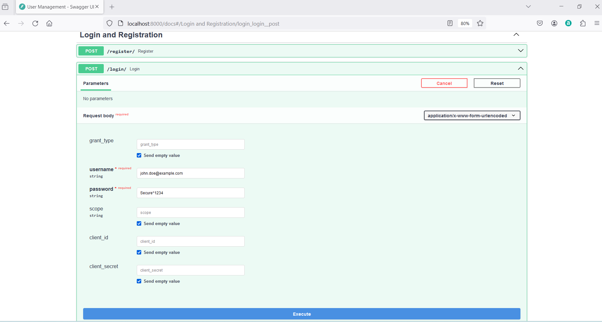
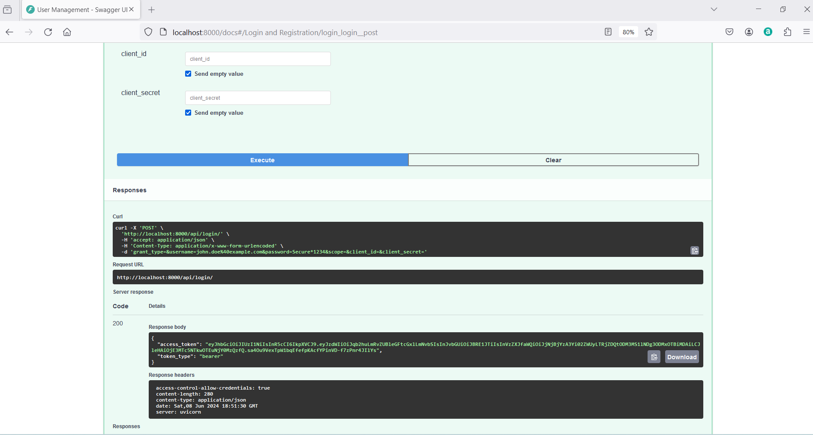

## FastAPI and Pydantic

2. **Outline the complete process of handling a user login request in your FastAPI application. Provide a step-by-step explanation with code examples from the project.**

 <u>Code examples from the project:</u>

[../app/routers/user_routes.py](../app/routers/user_routes.py)

    @router.post("/login/",
             response_model=TokenResponse, 
             tags=["Login and Registration"]
             )
    async def login(
        form_data: OAuth2PasswordRequestForm = Depends(),
        session: AsyncSession = Depends(get_db)
        ):
        try:
            user = await UserService.login_user(session, form_data.username, form_data.password)
            access_token_expires = timedelta(minutes=settings.access_token_expire_minutes)
            access_token = create_access_token(
                data={"sub": user.email, "role": str(user.role.name), "user_id": str(user.id)},
                expires_delta=access_token_expires
            )
            # Immediately decode to verify
            try:
                decoded = jwt.decode(access_token, settings.jwt_secret_key, algorithms=[settings.jwt_algorithm])
                logging.info(f"Immediate decode check: {decoded}")
            except jwt.PyJWTError as e:
                logging.error(f"Immediate decode failed: {e}")
            
            return {"access_token": access_token, "token_type": "bearer"}
        except InvalidCredentialsException as e:
            raise HTTPException(status_code=status.HTTP_401_UNAUTHORIZED, detail=str(e))
        except AccountLockedException as e:
            raise HTTPException(status_code=status.HTTP_403_FORBIDDEN, detail=str(e))

[Back to answer.md](../answer.md)
