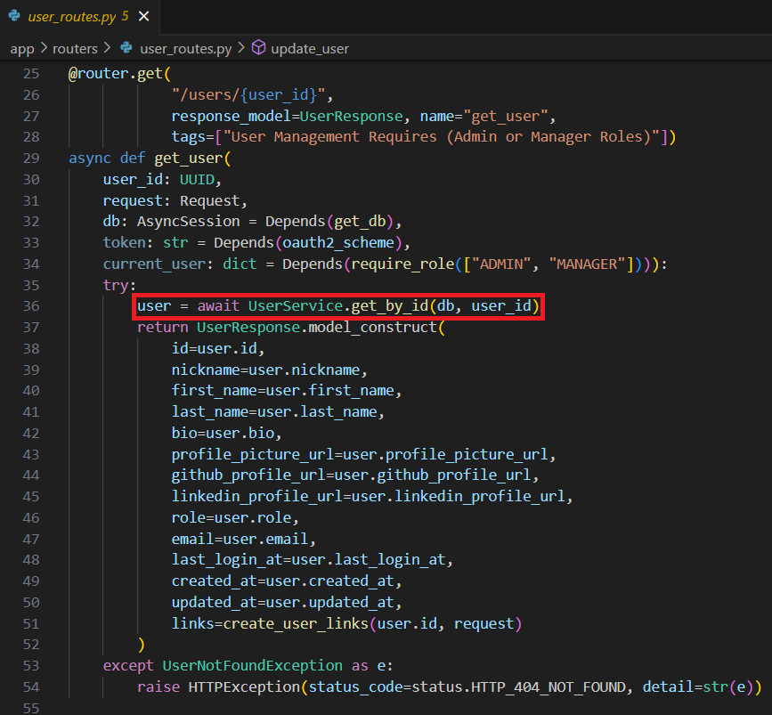
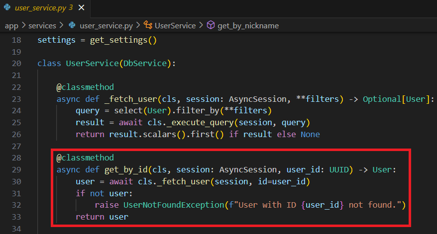

## FastAPI and Pydantic

3. **Explain the service repository pattern and how it is applied in your project. Provide an example of how routes are managed and linked to services.**

The service repository pattern is a way to organize and separate concerns in an application to promote maintainability, scalability, and testability. The pattern is broken down into components which are the Service Layer for business logic, the Repository Layer for data access, and Entities as core domain/business objects. Interactions between components include Service Layer and Repositories, Dependency Injection, and Domain Logic.

 [../app/routers/user_routes.py](../app/routers/user_routes.py)

 [../app/services/user_service.py](../app/services/user_service.py)

 [Back to answer.md](../answer.md)
