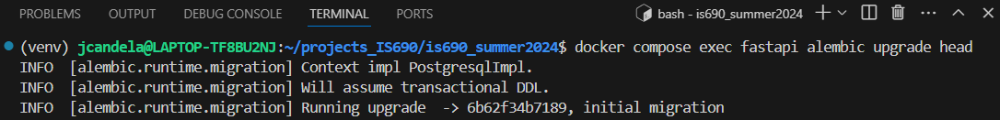

## Database Management with Alembic and SQLAlchemy

4. **How does Alembic manage database migrations, and why is this important for maintaining database schemas?**
   - Illustrate with an example of a migration script from the project.

Alembic manages database migrations by defining changes to the database schema as migration scripts. This is important since these migration scripts describe how to modify the schema to reflect the changes in the data model of the application.

 [Back to answer.md](../answer.md)
