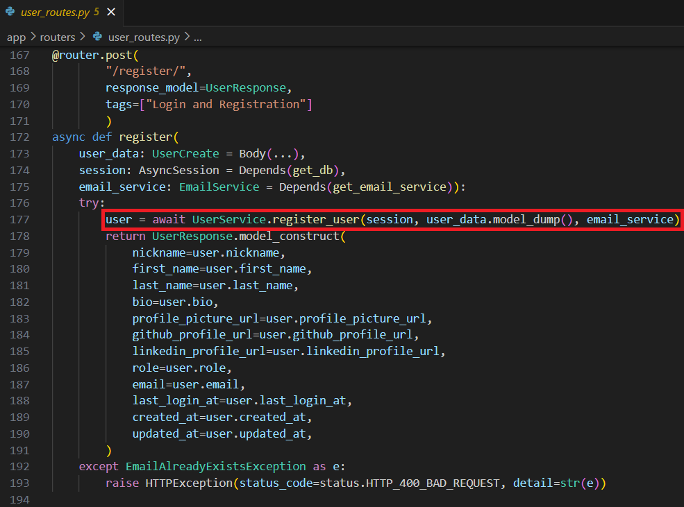
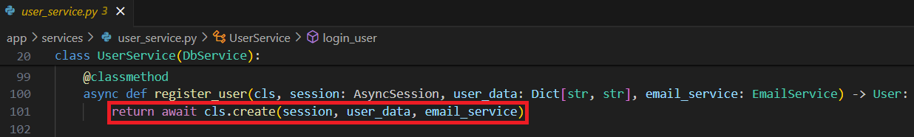
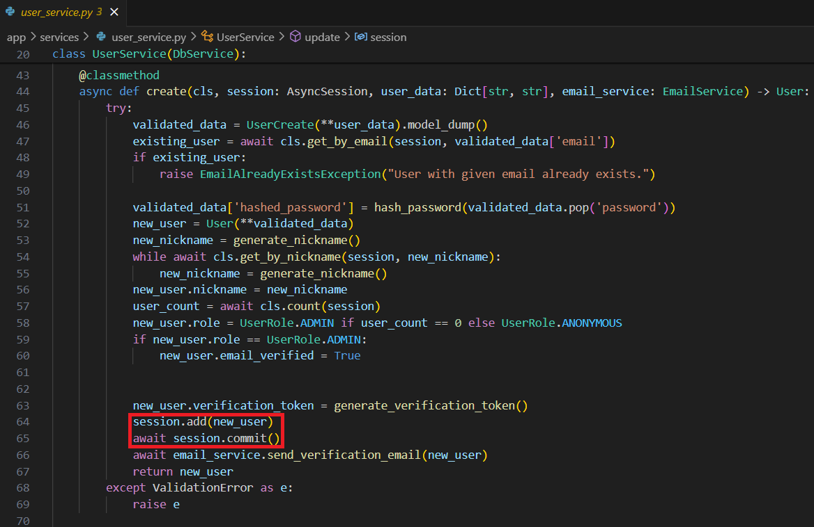

## JWT and User Authentication

8. **Describe the user registration logic in your project. Provide a pseudo-code workflow from the registration request to storing the user in the database.**

The new user registers by going to 'POST/register/Register' under "Login and Registration". 
Click the "Try it out" button in the top right hand corner. 
Enter the new user information and click the "Execute" button below.

 Pseudo-code workflow from the registration request to storing the user in the database.

Register User:

[../app/routers/user_routes.py](../app/routers/user_routes.py)

 Add New User to Database:

[../app/services/user_service.py](../app/services/user_service.py)

 [Back to answer.md](../answer.md)
