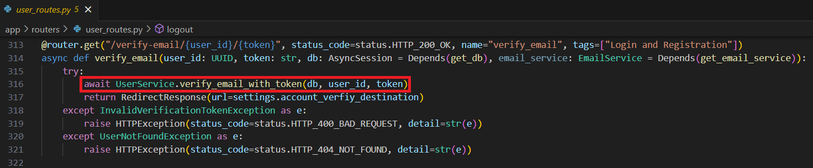
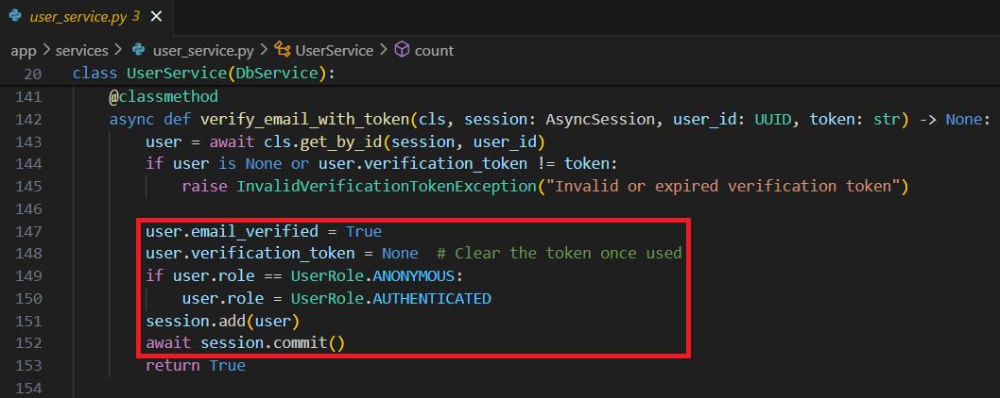

## JWT and User Authentication

9. **Detail the steps involved in the user email verification process. Provide a pseudo-code workflow from sending a verification email to activating the user's account.**

A user email is verified by going to 'GET /verify-email/{user_id}/{token} Verify Email' under "Login and Registration". 
Click the "Try it out" button in the top right hand corner. 
Enter the new user_id (id) and the token (verification_token) and click the "Execute" button below.

 Pseudo-code workflow from sending a verification email to activating the user's account.

Verify Email:

[../app/routers/user_routes.py](../app/routers/user_routes.py)

 Update User Email Verified Status in Database:

[../app/services/user_service.py](../app/services/user_service.py)

 [Back to answer.md](../answer.md)
