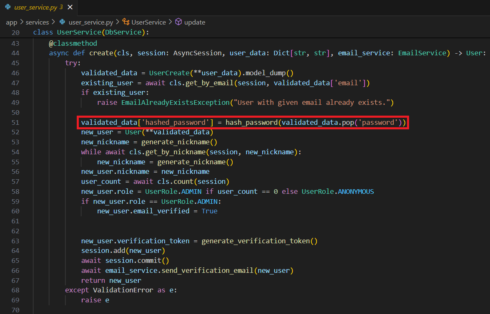
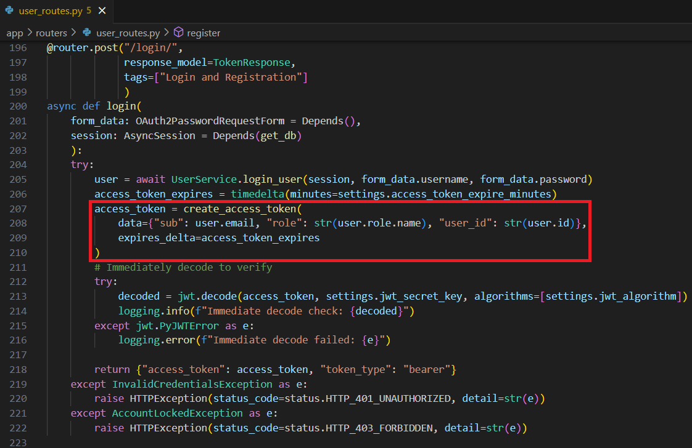

## Security Practices

11. **Explain the difference between hashing and encoding. Provide examples from your project where each is used:**
    - **Hashing:** Example and explanation with code
    - **Encoding:** Example and explanation with code

 Hashing algorithms are one-way functions that produce a hashed value of the data that can not be reversed which provides additional security. 
An example of when to use a hashing algorithm is when storing passwords (hashed passwords).

[../app/services/user_service.py](../app/services/user_service.py)

 Encoding is reversible, used to represent data in a specific format when the data is being transmitted or stored, but does not provide security. 
An example of when to use encoding is when generating a JWT token for a user login.

[../app/routers/user_routes.py](../app/routers/user_routes.py)

[../app/services/jwt_service.py](../app/services/jwt_service.py)

 [Back to answer.md](../answer.md)
