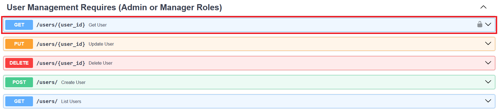
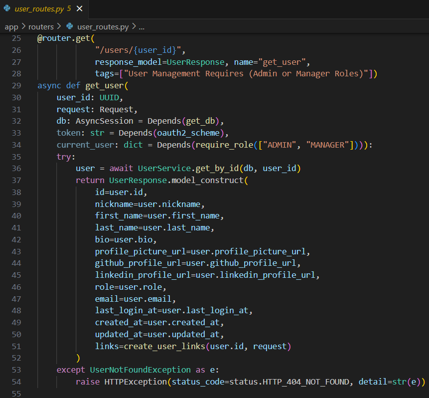

## API Design and Implementation

14. **What are REST APIs, and how do they function in your project? Provide an example of a REST endpoint from your user management system.**

REST APIs are a set of rules and conventions used for building and interacting with web services and use standard HTTP methods such as GET, POST, PUT, and DELETE to perform operations.

Below is an example of the "Get User" REST endpoint using the HTTP GET method from the user management system:

[../app/routers/user_routes.py](../app/routers/user_routes.py)

 [Back to answer.md](../answer.md)
