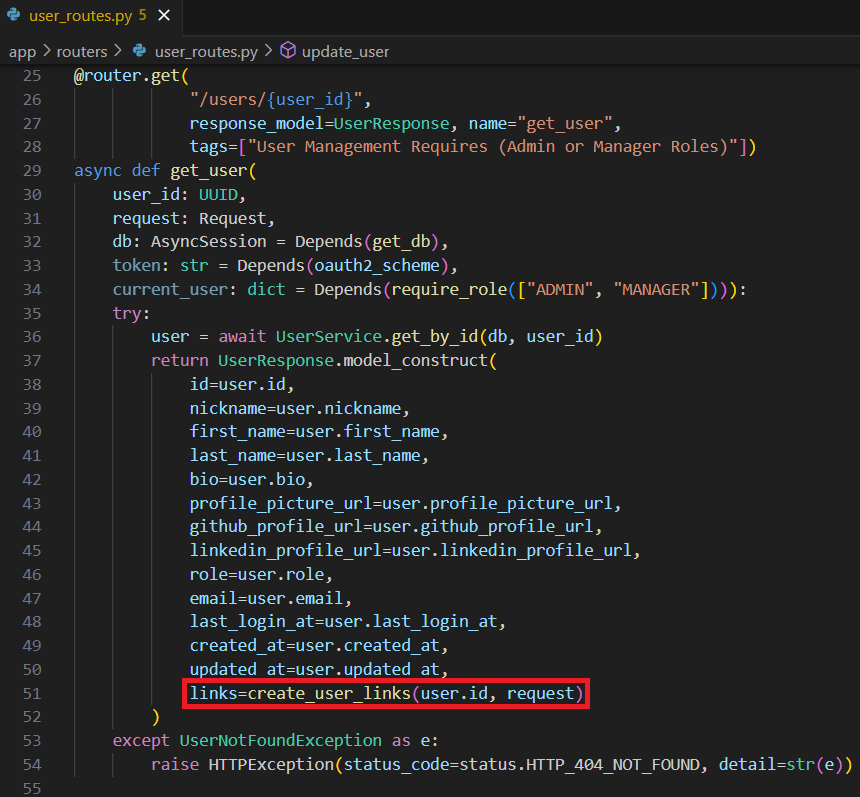
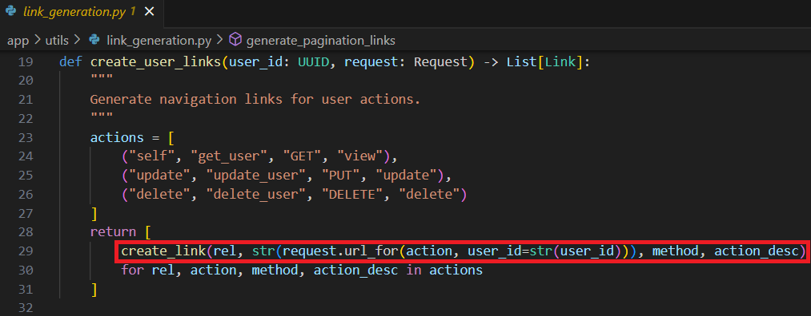
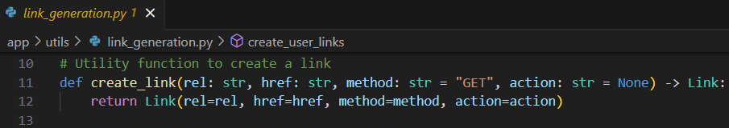

## API Design and Implementation

15. **What is HATEOAS (Hypermedia as the Engine of Application State)? Provide an example of its implementation in your project's API responses, along with a screenshot.**

HATEOAS is considered to be a portion of a REST API specification. The application's state transitions are driven by the hypermedia or links within API responses. When a client interacts with a server through an API, the server sends back data and includes links or references to related resources or actions to the client.

Below is an implementation example in the project's API response:

[../app/routers/user_routes.py](../app/routers/user_routes.py)

[../app/utils/link_generation.py](../app/utils/link_generation.py)

 [Back to answer.md](../answer.md)
