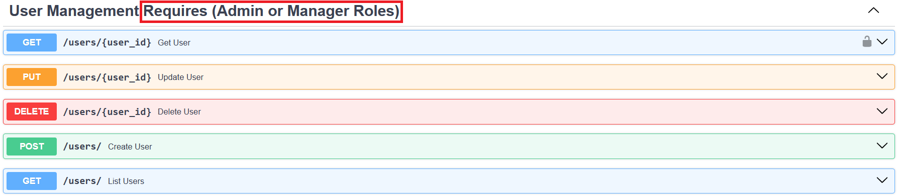

## Role-Based Access Control (RBAC)

16. **What is Role-Based Access Control (RBAC) and how is it implemented in your project?**

Role-Based Access Control (RBAC) is a method to manage and control access to system resources based on the roles of individual users. Users are then assigned to roles where each role contains certain permissions. A user role serves as an authorization group to which the user is assigned. The user roles that are defined in this project are ANONYMOUS, AUTHENTICATED, MANAGER, and ADMIN.

Below is an example of the API endpoints that require the individual user to have an ADMIN or a MANAGER role:

 [Back to answer.md](../answer.md)
