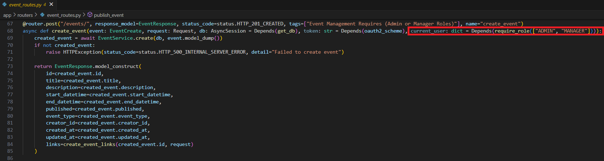

## Role-Based Access Control (RBAC)

18. **Provide a code example showing how RBAC is enforced in one of your FastAPI endpoints.**

Below is a code example showing how RBAC is enforced in the "Create Event" endpoint:

 [Back to answer.md](../answer.md)
