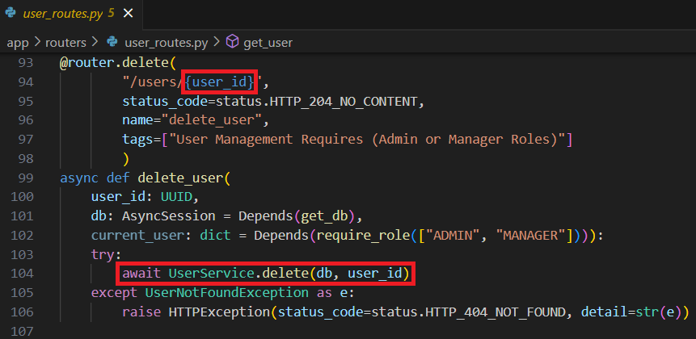

## Route Parameters and Pydantic Schemas

19. **Explain how route parameters are used in FastAPI. Provide an example of a route that takes a parameter and demonstrate how it is used within the endpoint.**

Route parameters are used in FastAPI as variables that can be used within an endpoint's request. When a request is made, the variable is extracted and passed to the function of the request for processing.

Below is an example of using a route parameter for the "Delete User" endpoint.
The user_id is a route parameter for delete_user that is passed to the delete method of the UserService class to remove the user from the database:

 [Back to answer.md](../answer.md)
