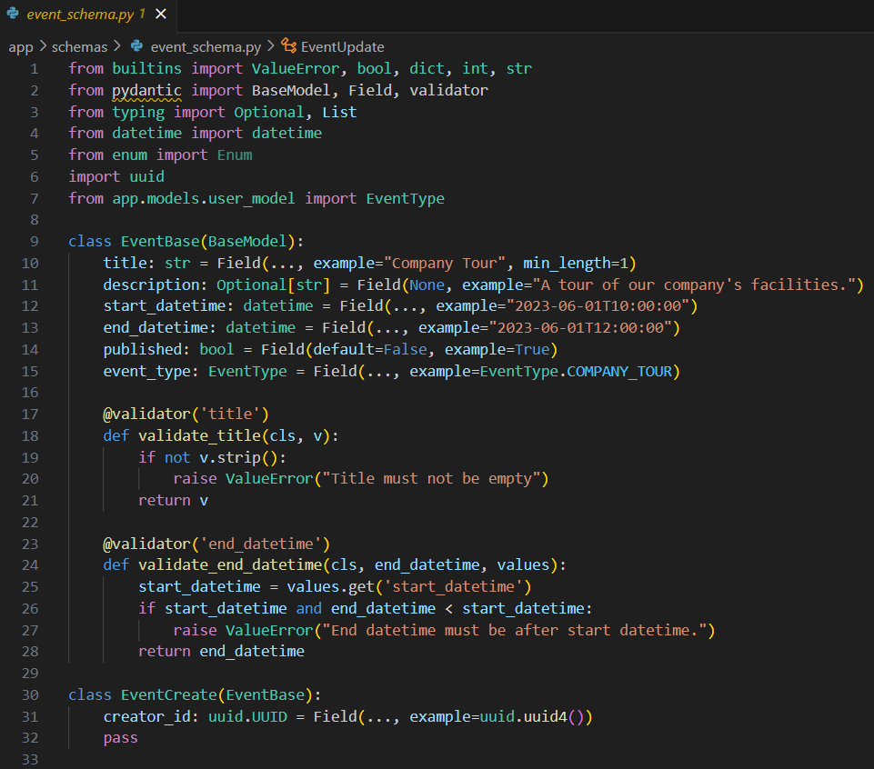
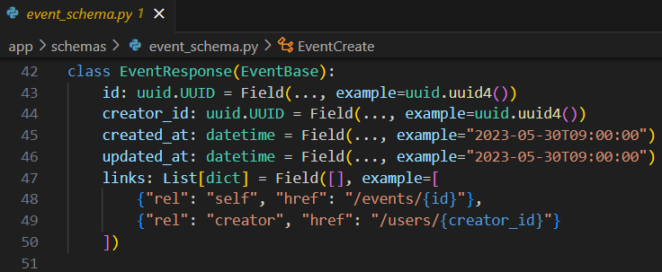
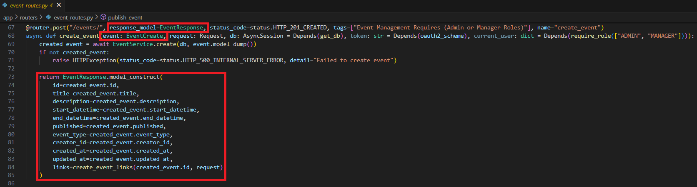
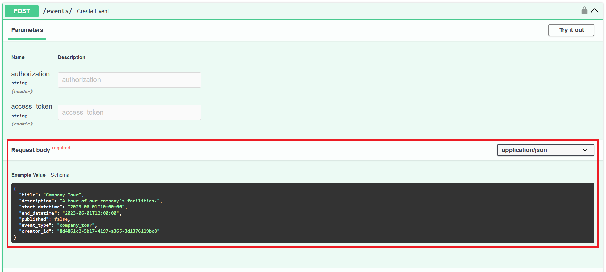
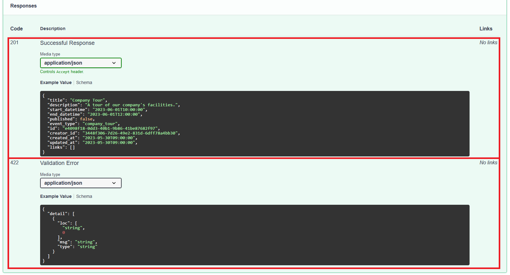

## Route Parameters and Pydantic Schemas

20. **How does FastAPI use Pydantic schemas to generate Swagger documentation? Provide an example from your project where a Pydantic schema is used and show the corresponding Swagger documentation.**

FastAPI uses Pydantic schemas to generate Swagger documentation by first defining the data models that use Pydantic. Data models describe the structure of the data, such as data types and validation rules. The Pydantic models are then used as parameters and return types in the FastAPI endpoint functions. Finally, the Pydantic models are used by FastAPI to generate the JSON schema for the request and response bodies where the JSON schemas are used to generate the Swagger documentation.

An example from the project where a Pydantic schema is used in the "Create Event" API endpoint.
In a web browser, enter "localhost:8000/docs" in the search bar:

[../app/schemas/event_schema.py](../app/schemas/event_schema.py)

[../app/routers/event_routes.py](../app/routers/event_routes.py)

Event Management Requires (Admin or Manager Roles)

 [Back to answer.md](../answer.md)
